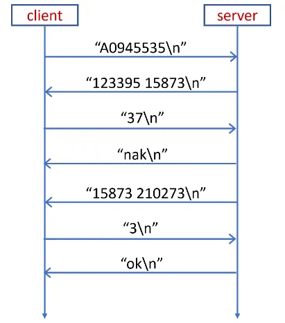
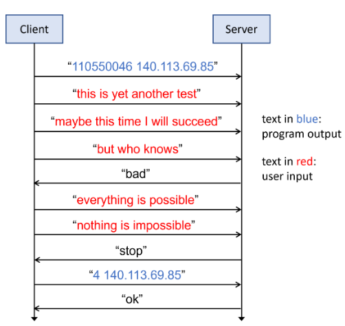
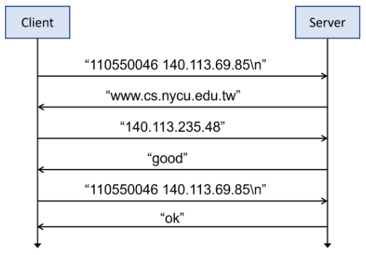
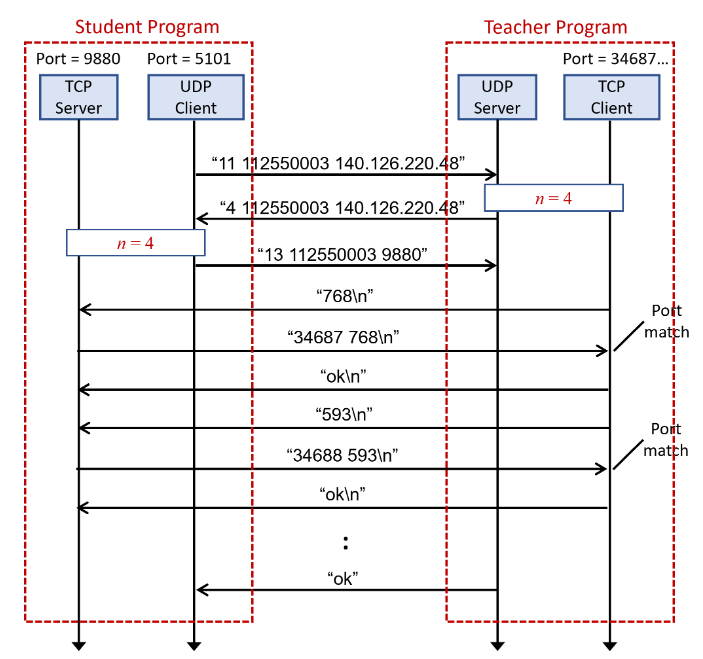
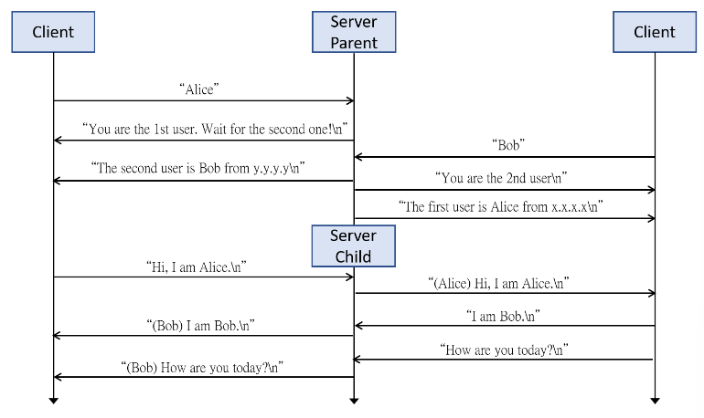
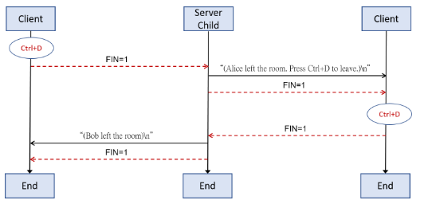
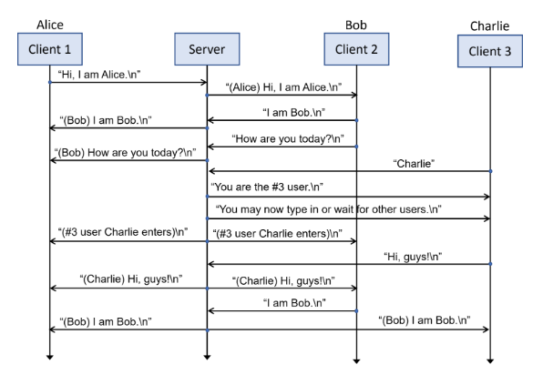
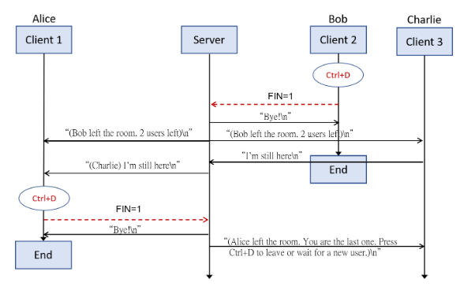

# NYCUCS-2024-WebProgramming
授課教授：嚴力行
## env setup
- env: Ubuntu
- requirements: gcc & make
- download: https://people.cs.nycu.edu.tw/~lhyen/np/unpv13e.tar.gz
   - After extracting, follow the instructions in the README file to proceed with the installation.
   - modify the type of the fourth parameter size in the inet_ntop function on line 60 of libfree/inet_ntop.c, changing it from size_t to socklen_t to prevent the error when executing make.

## lab1

1. send the student id to the server
2. get two numbers from the server
3. calculate the GCD of these two numbers
4. send the answer back to the server
   a. if receive nak: means some error occur, get two new numbers from the server again
   b. else if receive ok: everything’s correct, finish connection!
   
## lab2

1. send “$student_id $local_ip” to server
2. server will generate a secrete number n, and client won’t know the number
3. client keep sending msg to the user
4. if the number of msg matches the secrete number n, then server return stop
5. when receiving stop, send “$number_of_lines $local_ip” to the server
6. if the number of lines and local IP are correct, server return “ok” and end the connection.
7. if any reason, server return “bad”, the line sent won’t be counted.
8. **all of the above should be done using FD_SELECT to handle stdin/sock simultaneously.**

## lab3

1. send stu_id + local_ip to server
2. receive a host name from server
3. use gethostbyname to find the ip of corresponding name
4. return that ip to the serv
5. if ip is right, then serv return good, send stu_id + local_ip to serv again
6. if everything alright → serv return ok

## lab4

1. catch your TCP server address first (from UDP socket)
2. send “11 stu_id teacher_ip” to teacher’s UDP server
3. get random number n, which means there are n following requests
4. when receive request from teacher’s TCP client, reply “port_num received_string” to TCP client
5. when all the replies are correct, teacher’s UDP server will reply OK, then all the process is done.
   
## lab5

1. wait for two continuous client connections to build the chatting room.
2. each chatting rooms are independent to each other
3. when a client sent a message, the server should add the client’s ID in front of the message before sent it to others
4. when a new client entered the room, the server should notify all the others in the chatting room.
5. The clients should be able to send messages in any orders
6. after a user press Ctrl+D, Server should let the other one knows, and end the chatting room when the other also press Ctrl+D to leave the room.

## lab6

1. build a chatting room for at most ten people
2. clients can send messages in any order
3. when a client sent a message, the server should add the client’s ID in front of the message before sent it to others
4. when a new client entered the room, the server should notify all the others in the chatting room.
5. when the client pressed Ctrl+C/Ctrl+D to leave the chatting room, the server should be able to process and notify others in the chatting room.
6. if there are already ten clients in the room, the eleventh client should wait for a client to leave the room before he/she could enter the room.

## final project
https://github.com/annguo1106/2024-webProgramming-final-project
